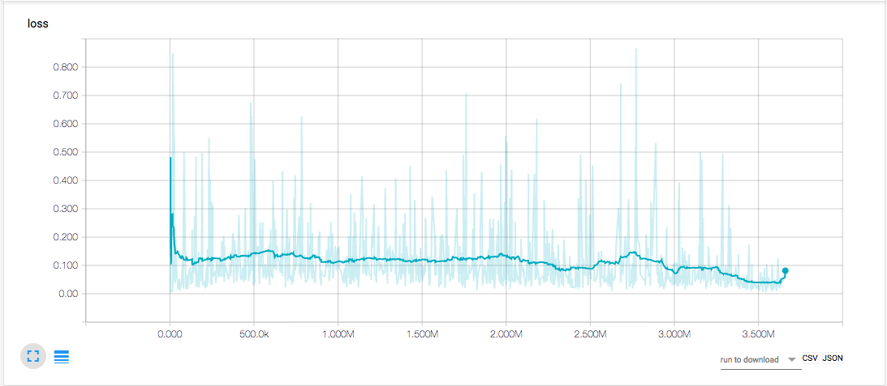
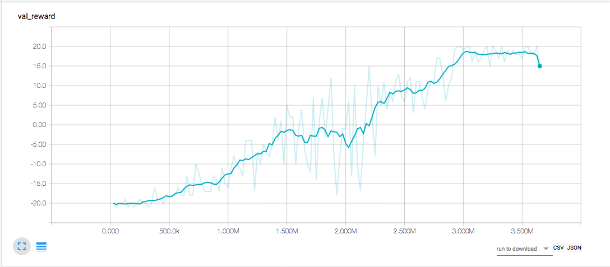

# DQN

An implementation of Deep Q Network: Mnih, V., Kavukcuoglu, K., Silver, D., Rusu, A. A., Veness, J., Bellemare, M. G., … Hassabis, D. (2015). Human-level control through deep reinforcement learning.

## Run

```
python exec.py --[env, gamma, epsilon, final_epsilon, final_exp_step, lr, memory_size, target_update_freq, gradient_update_freq, batch_size, replay_start, val_freq, log_freq_by_step, log_freq_by_ep, log_dir, weight_dir]
```

You can observe the progress via Tensorboard.

```
tensorboard --logdir runs
```




## References

* Roderick, M., MacGlashan, J., & Tellex, S. (2017). Implementing the Deep Q-Network
* Szymon Sidor & John Schulman. (2017) [OpenAI Baselines: DQN](https://blog.openai.com/openai-baselines-dqn/)